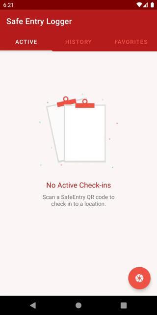
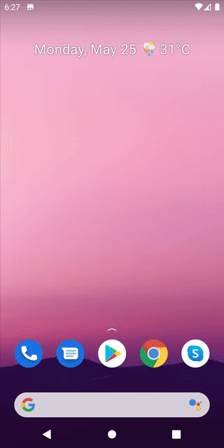
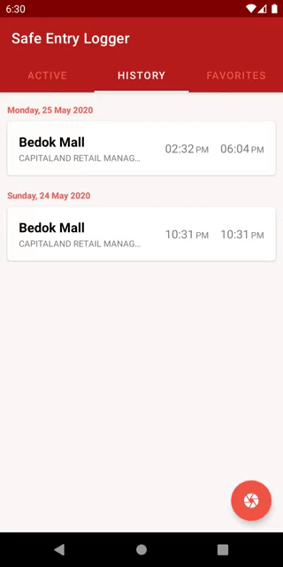

# SAVEntry
This repo is forked from https://github.com/lamkeewei/SafeEntryLogger. It already have some great value proposition that I am looking for:  
- Mark location as favorite to allow for easy check-in without scanning QR code.
- Checkout without having to scan QR code again.
- Automated tap on "check in" and "check out" buttons to skip redundant user interactions (since v2 of SafeEntry actually remembers your personal info)

This repo extends the app the app by exlpoiting features from the Android OS to further streamline the process between engaging your phone and reaching the "check in confirmed" page. The 2 major time and attention consuming hindrances of this process include:
1. The need for unlocking the phone. 
2. Searching for the app among all other apps. 
As such, Android OS features such as 
`Settings Tile` Makes the app easily accessible from anywhere, whether you are at lock screen or other apps. 
`Activity.showWhenLocked()` for checking in or out without having to unlock the phone
`widget` for bringing users straight to checked in state rather than having to open hte app and choosing which location. 

## SafeEntry vs SAVEntry:

Checking in from lock screen:    
SafeEntry:    
Unlock screen -> Search for scanner -> Open scanner -> point to scan -> press "check in" -> press "check in" again -> done   
SAVEntry (widget)  
Unlock screen -> Choose location from widget -> tap on the location -> done  
SAVEntry (Settings tile)  
open status bar -> tap on SAVEntry settings tile -> choose location -> done  
SAVEntry (from app)  
Unlock screen -> Search for SAVEntry app -> Open app -> choose location -> tap on location -> done  

Checking out from lock screen:  
SafeEntry:  
Unlock screen -> Search for scanner -> Open scanner -> point to scan -> press "check out" -> done  
SAVEntry (notification)  
tap on SAVEntry notification -> unlock screen -> done  
SAVEntry (Settings tile)  
open status bar -> tap on SAVEntry settings tile -> done  
SAVEntry (from app)  
Unlock screen -> Search for SAVEntry app -> Open app -> press "check out" -> done  

## Screenshots 
| Automated Checkin | Checkout Notification | Favorite Locations |
| ----------- | ----------- | --- |
|  |  |  |

## For end users
Download the apk from [releases](https://github.com/IzHoBX/SAVEntry/releases) and install on phone.

## For developers
- Clone the repo  
- Create a Firebase project in the Firebase console. 
- Add a new Android application into your Firebase project. 
- Download and place `google-services.json` in the `app` folder.

## Privacy Assurance
None of the user's personal info (NRIC and phone number) is upl oaded or stored in the cloud. The whereabouts of user at any given time is also not recorded on servers. All data are saved locally and users have full control over them. The handling of NRIC and phone number is through the webview, which is exactly the same as the default phone browser Chrome. 
This app is made open-source for open inspection so as to prove and maintain the above assurance. 

## Acknowledgments
- [Original repo](https://github.com/lamkeewei/SafeEntryLogger). It's great to have found something exactly what I wanted to do, saving me efforts on tinkering the app skeletons and webview intercepts.  
